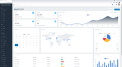

    

# JinyUI Web Component for Laravel
지니UI는 HTML, UI 컴포넌트를 자동으로 생성할 수 있는 객체지향 서버코드를 제공합니다. 제공되는 서버 코드는 HTML 시만틱 테크로 Alias되어 일반적인 HTML UI 코딩이 가능합니다.

 

## demo
지니UI는 지원하는 컴포넌트들을 테스트 확인할 볼 수 있는 데모 페이지를 제공합니다. 데모는 본 프로젝트를 실행후에 `localhost/jinyui`로 접속하시면 됩니다.
해당 데모의 파일들은 `/jiny/ui/resources/demo` 에서 확인할 수 있습니다.

        

 

## 사용법 및 문서
지니 UI에 대한 사용법은 `/resource/doc` 폴더를 참고해 주세요.

 

## License
The Laravel framework is open-sourced software licensed under the [MIT license](https://opensource.org/licenses/MIT).